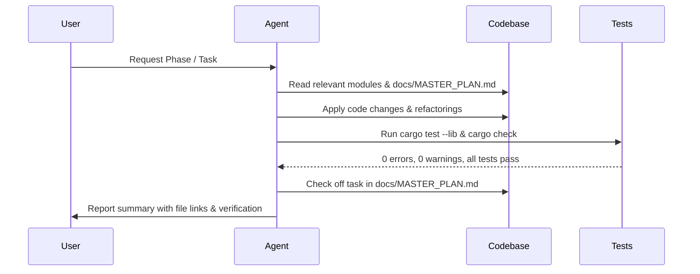

# AGENTS.md — AI Agent Operating Manual & Execution Guide

> **Zeshicast**: Native Linux Command Center & Raycast v2 Alternative  
> **Stack**: Rust 2021 + GTK4 (`gtk4-rs`) + `gtk4-layer-shell` | Wayland (Niri, Hyprland, Sway) | NixOS  
> **Primary Plan**: [`docs/MASTER_PLAN.md`](docs/MASTER_PLAN.md)

---

## 1. Project Overview & Architecture Map

Agents working on this codebase must understand the high-level module boundaries before modifying code:

```
src/
├── action.rs                 # Action, ActionKind, Secondary Action definitions
├── app.rs                    # Central application state, keyboard event dispatch, navigation
├── config.rs                 # TOML configuration, preferences, aliases, path resolutions
├── lib.rs                    # Public library facade and high-level query runner
├── main.rs                   # CLI REPL and one-shot execution entry point
├── placeholders.rs           # Template expansion ({date}, {clipboard}, {query})
│
├── bin/
│   └── zeshicast-gtk.rs      # GTK4 / Layer-Shell binary entry point
│
├── search/                   # Search providers (SearchProvider trait)
│   ├── apps.rs               # XDG .desktop discovery + nix-store scanning
│   ├── calculator.rs         # Arithmetic expression evaluator
│   ├── clipboard.rs          # Clipboard history search provider
│   ├── commands.rs           # TOML user custom commands and form binding
│   ├── emoji.rs              # Built-in emoji search by keyword
│   ├── files.rs              # Home directory file search
│   ├── media.rs              # MPRIS playback actions
│   ├── mod.rs                # Provider registry and ranking aggregation
│   ├── named_values.rs       # Tagged key-value search
│   ├── notifications.rs      # Notification / DND actions
│   ├── processes.rs          # Running processes and kill actions
│   ├── scripts.rs            # Raycast-compatible script parser and runner
│   ├── system.rs             # System actions (lock, suspend, power)
│   ├── web.rs                # Web search and translations
│   └── windows.rs            # Compositor window switcher (Niri / Hypr / Sway)
│
├── services/                 # Background services and OS integrations
│   ├── audio.rs              # WirePlumber / wpctl audio snapshots and volume
│   ├── battery.rs            # /sys/class/power_supply reader
│   ├── local_ai.rs           # Ollama / OpenAI HTTP API client
│   ├── media.rs              # MPRIS / playerctl metadata
│   ├── mod.rs                # Service exports
│   ├── network.rs            # /sys/class/net, nmcli, VPN, DNS resolution
│   ├── notifications.rs      # Dunst / Swaync history and DND state
│   ├── storage.rs            # SQLite database (rusqlite) for clipboard & history
│   ├── system_stats.rs       # /proc/stat, meminfo, df disk usage
│   └── thermal.rs            # /sys/class/thermal zone reader
│
└── ui/                       # GTK4 User Interface components
    ├── forms.rs              # Interactive form fields for missing command arguments
    ├── icons.rs              # FontAwesome and XDG theme icon helpers
    ├── launcher.rs           # Root search view and main window layout
    ├── launcher_helpers.rs   # Entry filtering and widget utilities
    ├── launcher_views.rs     # Navigation view wrappers
    ├── navigation.rs         # In-window view stack management
    ├── panels.rs             # Action panel, aliases, extensions browser
    ├── preferences.rs        # Settings editor UI
    ├── status_strip.rs       # Bottom clock/battery/network status bar
    ├── style.rs              # Embedded CSS theme tokens and style provider
    ├── views.rs              # Dashboard, System Monitor, Network, Media, AI views
    └── widgets.rs            # Reusable UI widgets (cards, chips, buttons)
```

---

## 2. Specialized Subagent Roles & Responsibilities

When delegating tasks or operating under specific prompts, adopt the relevant persona:

### 🎨 `UI Engineer`
- **Scope**: `src/ui/`, `src/bin/zeshicast-gtk.rs`, `src/app.rs`.
- **Rules**:
  - Never run heavy I/O or subprocesses on the GTK main thread.
  - Follow the **"Quiet Linux Cockpit"** design system: no glowing outlines, no random gradients, strict 12px radius, dark `#111216` background.
  - Ensure all new widgets have accessible labels and keyboard navigation (`Up/Down`, `Tab`, `Escape`, `Enter`).

### ⚙️ `Systems & D-Bus Engineer`
- **Scope**: `src/services/`, `src/search/windows.rs`, `src/search/system.rs`.
- **Rules**:
  - Prefer native D-Bus (`zbus`) / `/sys` / `/proc` access over spawning CLI binaries (`std::process::Command`).
  - Provide safe fallbacks: if a daemon (NetworkManager, Dunst, Ollama) is down, return an empty state without panicking or hanging.
  - Respect Linux security: never run commands with `sudo` or execute unescaped shell strings.

### 🧠 `AI Runtime Engineer`
- **Scope**: `src/services/local_ai.rs`, `src/ui/views/ai_chat.rs`.
- **Rules**:
  - Implement streaming token responses via Server-Sent Events (SSE) using asynchronous channels (`glib::MainContext::channel`).
  - Support cancellation via `AtomicBool` flags.
  - Do not hardcode external endpoints; respect user preferences (`ollama_endpoint`, `ollama_model`).

### 🔍 `Search & Extensions Engineer`
- **Scope**: `src/search/`, `src/placeholders.rs`, `src/config.rs`.
- **Rules**:
  - Keep ranking deterministic: score by exact match > prefix match > fuzzy subsequence > recent/frequency.
  - Maintain full compatibility with Raycast `@raycast.*` metadata comments.
  - Ensure file and app indexing runs in `< 5ms` on cached data.

### 🧪 `QA & Validation Agent`
- **Scope**: Entire repository, test suite, Nix environment.
- **Rules**:
  - Run `cargo test --lib` on any code modification.
  - Check for compiler warnings (`cargo check --lib`).
  - Ensure memory safety and lack of leaks in long-running daemon mode.

---

## 3. Strict Engineering & Coding Rules

1. **Zero Warnings Policy**: No `#[warn(unused)]` or `#[warn(dead_code)]` should remain after a PR/task. If code is intentionally kept for future phases, document it or gate it properly.
2. **Never Block GTK Event Loop**:
   - Long-running network or disk operations must use background threads (`std::thread::spawn` or Tokio runtime) and communicate with GTK widgets via `glib::MainContext::channel` or `glib::timeout_add_local`.
3. **No Unwraps in UI Callbacks**:
   - Replace `.unwrap()` and `.expect()` in UI event handlers with `if let` / `match` / logging (`eprintln!`), so a runtime error never crashes the active layer-shell window.
4. **Wayland & Layer-Shell Awareness**:
   - `gtk4-layer-shell` is initialized conditionally when the `layer-shell` feature is enabled. Always maintain compatibility with standard X11/Wayland window fallbacks when `layer-shell` is absent.
5. **Preserve Existing Tests**:
   - All 67 existing tests must pass at all times. New features must include dedicated unit tests in `src/tests.rs` or module-level `#[cfg(test)]`.

---

## 4. Verification & Testing Playbook

Always run these commands before declaring a task complete:

```bash
# 1. Run full unit and integration test suite
cargo test --lib

# 2. Check for warnings and compile errors in CLI mode
cargo check --lib

# 3. Check GTK4 GUI build (using Nix shell if on NixOS)
nix develop -f shell.nix --command cargo check --features gui
# or on standard Linux with GTK4 dev packages:
cargo check --features gui

# 4. Check layer-shell Wayland build
nix develop -f shell.nix --command cargo check --features gui,layer-shell
```

---

## 5. Execution Workflow (Step-by-Step Task Checklist)

When implementing phases from [`docs/MASTER_PLAN.md`](docs/MASTER_PLAN.md), follow this procedure:



1. **Locate Target Phase** in [`docs/MASTER_PLAN.md`](docs/MASTER_PLAN.md).
2. **Read Target Files** using `view_file` to understand context and avoid blind edits.
3. **Implement Changes** with clean modular separation (e.g., splitting `src/ui/views.rs` into submodules).
4. **Run Test Suite** using `run_command` (`cargo test --lib`).
5. **Update Master Plan** by checking off completed task checkboxes `[x]`.
6. **Report Clearly** to the user with clickable file links and exact test outputs.
