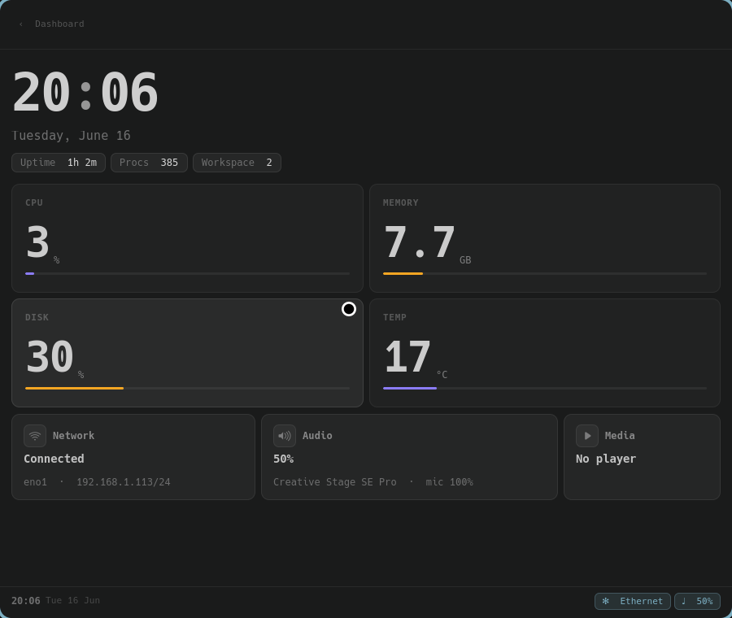
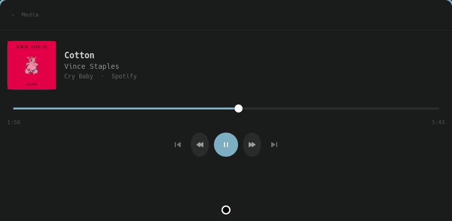
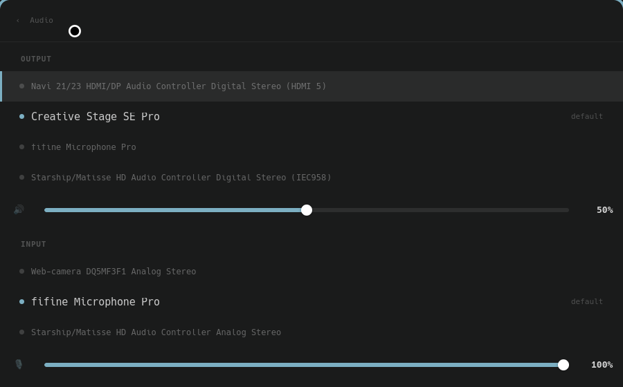
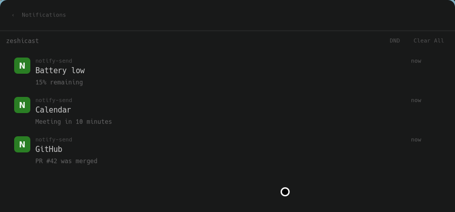
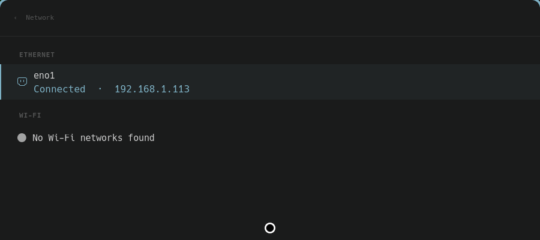
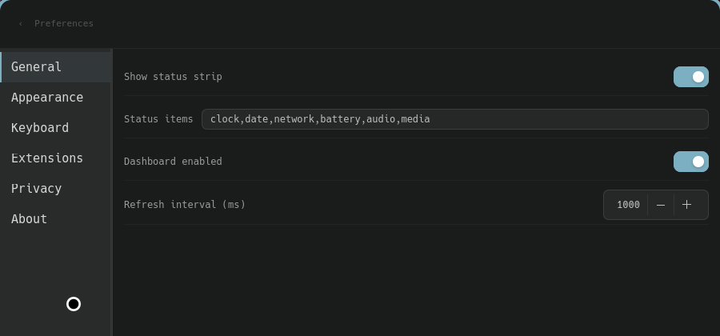

# zeshicast

Raycast-like launcher for Wayland (built for niri), written in Rust + GTK4.
The resident daemon is also a **self-contained service layer**: it is its own
freedesktop **notification daemon** (no swaync/dunst needed), reads media via
**MPRIS over D-Bus** (no playerctl), and records **text + image** clipboard
history. The headless `zeshicast` CLI works without any GUI dependency; the
GTK4 launcher and daemon are behind the `gui` feature.

See [docs/vicinae-parity-roadmap.md](docs/vicinae-parity-roadmap.md) for the
roadmap. For threat model and local data handling, read
[docs/security.md](docs/security.md) and [docs/privacy.md](docs/privacy.md).

## Screenshots



| | |
|---|---|
| **Media** — MPRIS over D-Bus, album art, scrubber | **Audio** — output/input devices and volumes |
|  |  |
| **Notifications** — built-in freedesktop D-Bus server | **Network** — Ethernet + Wi-Fi |
|  |  |
| **Preferences** — sidebar + auto-saving fields | |
|  | |

## Install on NixOS (flake)

The flake builds both binaries and ships a NixOS module that runs the daemon
(warm index + notification server + clipboard capture) as a graphical-session
systemd **user** service.

```nix
# flake.nix of your system config
{
  inputs.zeshicast.url = "github:zeshi09/zeshicast";

  outputs = { nixpkgs, zeshicast, ... }: {
    nixosConfigurations.mybox = nixpkgs.lib.nixosSystem {
      modules = [
        zeshicast.nixosModules.default
        { services.zeshicast.enable = true; }
      ];
    };
  };
}
```

`nixos-rebuild switch`, then:

```bash
systemctl --user status zeshicast        # the daemon (owns org.freedesktop.Notifications)
systemctl --user restart zeshicast
```

Bind a key in niri to pop the launcher (the daemon shows its window instantly):

```kdl
// ~/.config/niri/config.kdl
binds { Mod+Space { spawn "zeshicast-gtk"; } }
```

> The notification server owns `org.freedesktop.Notifications` — **disable any
> other notification daemon** (swaync / mako / dunst) or it won't acquire the
> name. Only one process can own it.

Without the module you can also just `nix run github:zeshi09/zeshicast`
(launches the GTK launcher), or add `zeshicast.packages.${system}.default` to
`environment.systemPackages` and bind/spawn the binaries yourself.

## Install with Home Manager (flake)

Use the Home Manager module, not the NixOS module:

```nix
# flake.nix of your Home Manager config
{
  inputs.zeshicast.url = "github:zeshi09/zeshicast";

  outputs = { nixpkgs, home-manager, zeshicast, ... }: {
    homeConfigurations.myuser = home-manager.lib.homeManagerConfiguration {
      pkgs = nixpkgs.legacyPackages.x86_64-linux;
      modules = [
        zeshicast.homeManagerModules.default
        { services.zeshicast.enable = true; }
      ];
    };
  };
}
```

If your Home Manager config is imported from a NixOS flake, put the same import
inside `home-manager.users.<name>`:

```nix
{
  home-manager.users.myuser = {
    imports = [ inputs.zeshicast.homeManagerModules.default ];
    services.zeshicast.enable = true;
  };
}
```

`homeManagerModules.default` installs the package through `home.packages` and
creates the `zeshicast` systemd user service. Do not import
`zeshicast.nixosModules.default` in a pure Home Manager configuration: that
module uses NixOS-only options such as `environment.systemPackages`.

## Run from a checkout

```bash
cargo run --bin zeshicast -- firefox          # headless CLI
nix build && ./result/bin/zeshicast-gtk       # built GTK launcher
# Dev (Wayland overlay):
nix develop --command cargo run --features gui,layer-shell --bin zeshicast-gtk
# Without layer-shell (fallback):
nix develop --command cargo run --features gui --bin zeshicast-gtk
```

> The launcher defaults to `GSK_RENDERER=cairo` (the GTK Vulkan/NGL renderer
> clips glyph tops on some drivers); override with `GSK_RENDERER=ngl` for GPU
> rendering.

Results carry Raycast-style metadata: title, subtitle, category, score and icon.
The GTK launcher renders this as a compact command list with action buttons.
Secondary actions (copy value, open folder, pin, unpin, set alias) are available
in the action panel.

## Built-in queries

```text
firefox                   Search installed .desktop apps (reads XDG_DATA_DIRS)
file invoice              Search files under $HOME, open via xdg-open
calc (12 + 8) / 5         Evaluate an expression
shell systemctl status    Run a shell command
system lock               Lock screen
system suspend            Suspend machine
system settings           Open desktop settings
system restart            Reboot
system power              Power off
proc firefox              Search processes and build kill actions
audio vol                 Volume up/down, mute, mic mute
audio brightness          Brightness up/down
media next                MPRIS playback controls over D-Bus
notify dnd                Notification history and DND (built-in D-Bus server)
net wifi                  Toggle Wi-Fi, open network settings
niri screenshot           Interactive screenshot (region)
niri workspace            Focus next/previous workspace, move window
hypr fullscreen           Hyprland: fullscreen, float, close, workspaces
sway reload               Sway: reload, fullscreen, float, close, workspaces
win firefox               Focus a running window (niri/Hyprland/sway)
ai explain monads         Ask local AI through Ollama; response copied to clipboard
trans hello in ru         Translate via LibreTranslate — result copied to clipboard
translate hi in de        Same as trans, explicit prefix
clip password             Search clipboard history
```

`system restart` and `system power` are only returned for explicit `system ...`
queries. `ai`, `trans`/`translate`, `niri`, `hypr`, and `sway` results are only
shown for their respective prefixes.

App detection reads `$XDG_DATA_HOME` and `$XDG_DATA_DIRS` so NixOS paths like
`/run/current-system/sw/share/applications` are discovered automatically.
Flatpak apps in `~/.local/share/flatpak/exports/share/applications` and
`/var/lib/flatpak/exports/share/applications` are also included.
App icons are sourced from the `Icon=` field in each `.desktop` file.
The binary stem (e.g. `zen-beta`) is added to the search haystack so typing
the executable name finds the app.

## GTK shortcuts

```text
Enter        Run selected result (opens form panel for commands with missing args)
Ctrl+Enter   Copy selected value
Ctrl+K       Action panel — pin, unpin, set alias, secondary actions
Ctrl+B       Extension browser — list all custom commands
Ctrl+,       Preferences editor — UI, privacy, AI, translate, integration settings
Ctrl+D       Dashboard — clock, system, network, audio, media, notifications
Ctrl+T       System Monitor — load, memory, disk, temperatures, top processes
Ctrl+N       Network view — Ethernet + Wi-Fi, connect/disconnect
Ctrl+M       Media view — MPRIS over D-Bus, album art, scrubber, controls
Ctrl+O       Audio mixer — output/input devices and volumes
Ctrl+U       Notifications view — history, DND, clear all, per-item dismiss
Ctrl+I       AI Chat — local prompt/answer view
Ctrl+H       Clipboard history — text + images, copy, delete, clear
Esc          Hide (daemon mode) or quit
Up/Down      Move selection
```

## Open a view directly

Convenience flags jump straight to a view (works against the running daemon):

```bash
zeshicast-gtk --view clipboard      # or --clipboard
zeshicast-gtk --view dashboard      # --dashboard, --network, --media, --audio,
zeshicast-gtk --view media          # --ai, --system, --notifications, --emoji, --fonts
```

## CLI usage

```bash
zeshicast                       Start interactive REPL
zeshicast firefox               Print matching actions and exit
zeshicast --export [file]       Export config to tar.gz, excluding API keys by default
zeshicast --export [file] --include-secrets
                                Export config including API keys and secret-like preferences
zeshicast --import file.tar.gz  Import config from tar.gz
```

## Daemon mode

A hidden resident GTK process keeps the launcher index warm for instant display,
**owns `org.freedesktop.Notifications`** (records every notification into the
history) and records clipboard changes (text + images). On NixOS use the flake
module above; otherwise run it directly:

```bash
zeshicast-gtk --daemon    # start the resident daemon
zeshicast-gtk             # pop the launcher window (forwards to the daemon)
zeshicast-gtk --quit      # stop the daemon
```

Clipboard/notification capture happens while the daemon holds the session; the
launcher is a single GApplication instance, so re-invoking `zeshicast-gtk` just
shows the existing daemon's window. The notification server can record history
only if it owns `org.freedesktop.Notifications`; if another daemon already owns
that D-Bus name, zeshicast logs the conflict and notification history/DND actions
will not reflect that external daemon.

## Non-Nix install

```bash
scripts/install-user.sh --enable-daemon --start-daemon
```

Installs binaries to `~/.local/bin`, desktop entries to
`~/.local/share/applications`, and a systemd user service to
`~/.config/systemd/user/zeshicast-gtk.service`.

```bash
systemctl --user status zeshicast-gtk.service
systemctl --user restart zeshicast-gtk.service
systemctl --user enable zeshicast-gtk.service
systemctl --user disable zeshicast-gtk.service
```

The non-Nix unit is installed under `graphical-session.target` so the daemon
starts with the desktop session and stops with it. If your distro or compositor
does not start that target, keep the same unit and attach it to
`default.target` instead:

```bash
systemctl --user add-wants default.target zeshicast-gtk.service
```

## Runtime Dependencies

The GTK launcher is a Wayland/GTK4 application. Build-time dependencies are
provided by the Nix flake; non-Nix installs need GTK4, GLib, gdk-pixbuf, Pango,
Cairo, Wayland, and optionally `gtk4-layer-shell` when building
`--features gui,layer-shell`.

Runtime integrations use session tools when present:

- `wl-copy`/`wl-paste` for Wayland clipboard capture and copy-back;
- `xclip` as a clipboard fallback on X11-style sessions;
- compositor tools for compositor-specific actions and window switching:
  `niri`, `hyprctl`, or `swaymsg`;
- `wpctl` for PipeWire/WirePlumber audio controls;
- `nmcli` and `ip` for NetworkManager/network views;
- `brightnessctl` for brightness actions;
- `grim`/`slurp` for screenshot actions in some compositor command sets;
- `wtype` for the optional "type text" secondary action;
- `tar` for import/export.

The Nix package wraps `wl-clipboard` into PATH. The other tools are expected to
come from the user's graphical session or system packages; missing tools usually
make the related action fail or disappear rather than preventing the launcher
from starting.

With the NixOS or Home Manager module, declare optional runtime tools explicitly:

```nix
{
  services.zeshicast = {
    enable = true;
    extraRuntimePackages = with pkgs; [
      wireplumber     # wpctl audio controls
      networkmanager  # nmcli network controls
      iproute2        # ip address snapshots
      brightnessctl
      bluez           # bluetoothctl
      wtype
      grim
      slurp
      xclip
    ];
  };
}
```

Compositor tools (`niri`, `hyprctl`, `swaymsg`) should normally come from the
running compositor package or session configuration.

## Wayland hotkey

Bind this command in your compositor:

```bash
~/.local/bin/zeshicast-gtk
```

```ini
# Niri
spawn-at-startup "~/.local/bin/zeshicast-gtk" "--daemon"
# bind in config.kdl: key "Super+Space" { spawn "~/.local/bin/zeshicast-gtk"; }

# Hyprland
bind = SUPER, SPACE, exec, ~/.local/bin/zeshicast-gtk

# sway / i3
bindsym $mod+space exec ~/.local/bin/zeshicast-gtk
```

For GNOME/KDE, add the command through the desktop environment keyboard shortcuts
settings.

## Config

```text
~/.config/zeshicast/quicklinks.txt   lines: Name | tag1,tag2 = https://example.com?q={{query}}
~/.config/zeshicast/snippets.txt     lines: Name | tag1,tag2 = text to copy
~/.config/zeshicast/commands/*.toml  custom shell commands
~/.config/zeshicast/preferences.toml global extension preferences
~/.config/zeshicast/zeshicast.db     SQLite clipboard and usage history
~/.cache/zeshicast/clipboard/        cached clipboard image PNGs
~/.config/zeshicast/aliases.txt      lines: ff = Firefox
~/.config/zeshicast/pins.txt         lines: App:Firefox or Firefox
```

Pins and aliases can be set from the CLI action menu or the GTK action panel.
Clipboard rows are retained according to `clipboard_retention` and cached image
PNGs are pruned when history is pruned, individual image entries are deleted, or
clipboard history is cleared.

### Placeholders

```text
{{query}}           current search query
{{arg:name}}        typed command argument
{{pref:name}}       extension preference value
{{clipboard}}       latest clipboard history entry
{{date}}            local date as YYYY-MM-DD
{{time}}            local time as HH:MM:SS
{{datetime}}        local date and time
{{date:%d.%m.%Y}}   custom chrono/strftime format
{{time:%H:%M}}      custom time format
{{calc:2 + 2}}      calculator result
```

### Quicklinks and snippets

```text
# ~/.config/zeshicast/quicklinks.txt
Google    | web,search = https://www.google.com/search?q={{query}}
GitHub    | dev,search = https://github.com/search?q={{query}}

# ~/.config/zeshicast/snippets.txt
Today     | date      = {{date}}
Meeting   | work,date = {{date:%d.%m.%Y}} {{time:%H:%M}}
Debug     | dev       = Query: {{query}}, Clipboard: {{clipboard}}
VAT       | finance   = Total: {{calc:100 * 1.2}}
```

Tags are optional. Search matches both names and tags.

## Security And Privacy Notes

Custom commands are local extensions and can execute shell commands if they
declare the `shell` capability. Treat command TOML files like scripts: install
only commands you trust, review placeholders, and prefer the narrowest
permissions needed. Zeshicast shell-quotes placeholder values before `sh -c`,
but the command template itself is still executable code.

Clipboard history, notification history, recent usage, aliases, pins, and
preferences are local state. Clipboard/usage history lives in
`~/.config/zeshicast/zeshicast.db`; image clipboard entries additionally write
PNG files under `~/.cache/zeshicast/clipboard/`. Use Preferences > Privacy to
pause/disable clipboard capture, disable image capture, or adjust retention.
`zeshicast --export` excludes API keys and secret-like preference keys by
default; pass `--include-secrets` only for trusted backups.

See [docs/security.md](docs/security.md) and [docs/privacy.md](docs/privacy.md)
for the full threat model and storage policy.

### Custom commands (shell mode)

```toml
# ~/.config/zeshicast/commands/deploy.toml
name = "Deploy"
mode = "shell"
keyword = "deploy"
argument_hint = "<env> <service>"
command = "cd {{pref:workspace}} && deploy --env {{arg:env}} --service {{arg:service}} --force {{arg:force}}"
description = "Deploy a service"
tags = ["work", "devops"]
icon = "utilities-terminal-symbolic"
permissions = ["shell"]
arguments = [
  { name = "env",     type = "enum", required = true, options = ["dev", "prod"] },
  { name = "service", type = "text", required = true },
  { name = "force",   type = "bool", default = "false" }
]

[preferences]
workspace = "~/Code"

[env]
DEPLOY_ENV   = "{{arg:env}}"
DEPLOY_TOKEN = "{{pref:deploy_token}}"
```

Only `name` and `command` are required. Optional fields: `category`, `keyword`,
`argument_hint`, `arguments`, `preferences`, `env`, `description`, `tags`,
`icon`, `permissions`.

A keyword enables direct command mode: `deploy prod api worker` sets `{{query}}`
to `prod api worker`, `{{arg:env}}` to `prod`, and `{{arg:service}}` to
`api worker`. Supported argument types: `text`, `number`, `path`, `bool`, `enum`.
Commands with missing required arguments are shown as disabled warning actions
until the input is complete. Commands run through `sh -c`.

> **Do not wrap placeholders in your own quotes.** Substituted values
> (`{{query}}`, `{{clipboard}}`, `{{arg:*}}`, `{{pref:*}}`, …) are automatically
> shell-quoted before reaching `sh -c`, so untrusted input cannot inject
> commands. Write `--env {{arg:env}}`, not `--env '{{arg:env}}'`.

`[env]` values are expanded with the same placeholders as `command` and injected
only into that command process.

`permissions` is enforced. Shell-mode commands require `"shell"` or they are
shown as blocked actions. JSON-mode commands also require `"shell"` to execute
their producer command, and returned actions require matching capabilities:
`"shell"`, `"network"`/`"open_url"`, `"filesystem"`/`"open_path"`, and
`"clipboard_write"`.

### Custom commands (JSON mode)

```toml
# ~/.config/zeshicast/commands/search-docs.toml
name = "Search Docs"
mode = "json"
keyword = "docs"
argument_hint = "<query>"
command = "my-doc-search {{query}}"
permissions = ["shell", "network", "clipboard_write"]
arguments = [
  { name = "query", type = "text", required = true }
]
```

The command stdout must be a JSON array (or `{"results": [...]}`) of objects:

```json
[
  {
    "title": "Rust",
    "subtitle": "Open rust-lang.org",
    "icon": "emblem-web-symbolic",
    "action": { "type": "open_url", "value": "https://www.rust-lang.org" }
  },
  {
    "title": "Copy crate name",
    "action": { "type": "copy", "value": "gtk4" }
  }
]
```

Supported action types: `open_url`, `open_path`, `copy`, `shell`, `none`.
Actions whose capabilities are not declared are shown as blocked warning
results instead of being executable.
JSON commands execute only on direct keyword invocation, e.g. `docs gtk listbox`.

### Example extension pack

Ready-to-copy examples are in `packaging/examples/commands/`:

```text
github.toml     gh <query>       — open GitHub search in browser
weather.toml    weather <city>   — open wttr.in forecast
dict.toml       dict <word>      — open Merriam-Webster
docker-ps.toml  docker <filter>  — list running containers (JSON mode, Enter stops)
git-log.toml    git-log <path>   — show recent commits in pref:workspace
```

Copy any file to `~/.config/zeshicast/commands/` to enable it.

### Global preferences

```toml
# ~/.config/zeshicast/preferences.toml
workspace  = "/home/me/Code"
default_env = "dev"
```

The global file overrides per-command `[preferences]` defaults. Supported TOML
scalar types: string, integer, float, boolean.

Edit via `Ctrl+,` in the GTK launcher or directly in the file.

### AI and translate preferences

```toml
# ~/.config/zeshicast/preferences.toml
ai_provider        = "ollama"                      # set to "openai" for /v1/chat/completions
ui_font_family    = "Outfit, Inter, Noto Sans, sans-serif"
ui_font_size      = "15"
show_status_strip  = "true"
status_items       = "clock,date,network,battery,audio,media"
dashboard_enabled  = "true"
network_enabled    = "true"
media_enabled      = "true"
notifications_enabled = "true"
notifications_history_enabled = "true"
clipboard_history_enabled = "true"
clipboard_private_mode = "false"
clipboard_retention = "100"
clipboard_capture_images = "true"
export_include_secrets = "false"
ai_enabled         = "true"
dashboard_poll_interval_ms = "1000"
ollama_endpoint    = "http://localhost:11434"
ollama_model       = "gemma4:e4b"
ai_endpoint        = "http://localhost:11434/v1"   # used when ai_provider = "openai"
ai_model           = "gemma4:e4b"
ai_api_key         = ""
translate_endpoint = "https://libretranslate.com"
translate_api_key  = ""
translate_target   = "en"
```

## Implemented features

```text
Core search        apps (.desktop, XDG_DATA_DIRS), files, calculator, shell
Quicklinks         keyword-triggered browser URLs with placeholders
Snippets           copy-to-clipboard text templates with placeholders
Custom commands    shell and JSON modes, typed args, forms, env, preferences
User memory        recent actions, pins, aliases
Action UX          primary action, secondary actions, action panel (Ctrl+K)
Clipboard history  GTK daemon records text + images; thumbnails, copy-back
Placeholders       {{query}} {{arg:}} {{pref:}} {{clipboard}} {{date}} {{calc:}}
System actions     lock, suspend, settings, restart, power off
Process actions    search running processes, build kill actions
Audio actions      volume up/down, mute, mic mute, brightness
Network actions    Wi-Fi toggle, network settings
Niri actions       screenshot, workspaces, window control (niri msg)
Hyprland actions   screenshot, fullscreen, float, close, workspaces (hyprctl)
Sway actions       screenshot, fullscreen, float, close, workspaces (swaymsg)
Window switching   win <query> — focus open windows (niri/Hyprland/sway, live query)
AI chat            Ollama-compatible local endpoint, OpenAI-compatible quick mode optional
Dashboard          optional control view with clock, system, network, audio, media, notifications
System monitor     /proc stats, thermal sensors, top process list, terminate selected process
Network view       interfaces, IP/MAC copy, DNS, nmcli Wi-Fi/VPN snapshot and actions
Media view         MPRIS over D-Bus — album art, scrubber, prev/seek/play/next
Notifications      built-in freedesktop D-Bus server — history, DND, dismiss/clear
Translation        LibreTranslate with language suffix (trans hello in ru)
GTK4 launcher      Layer-shell overlay (Wayland), daemon mode, clipboard monitor
Command forms      GTK form panel for commands with missing required arguments
Extension browser  Ctrl+B — list and inspect all custom commands
Preferences editor Ctrl+, — edit UI/privacy/AI/integration settings without touching files
Permission field   enforced capabilities: shell, network/open_url, filesystem/open_path, clipboard_write
Import/export      zeshicast --export / --import; export excludes API keys unless explicitly enabled
Example extensions packaging/examples/commands/ — github, weather, dict, docker, git
Nix flake          packages, apps (nix run), NixOS module (systemd user service)
```
