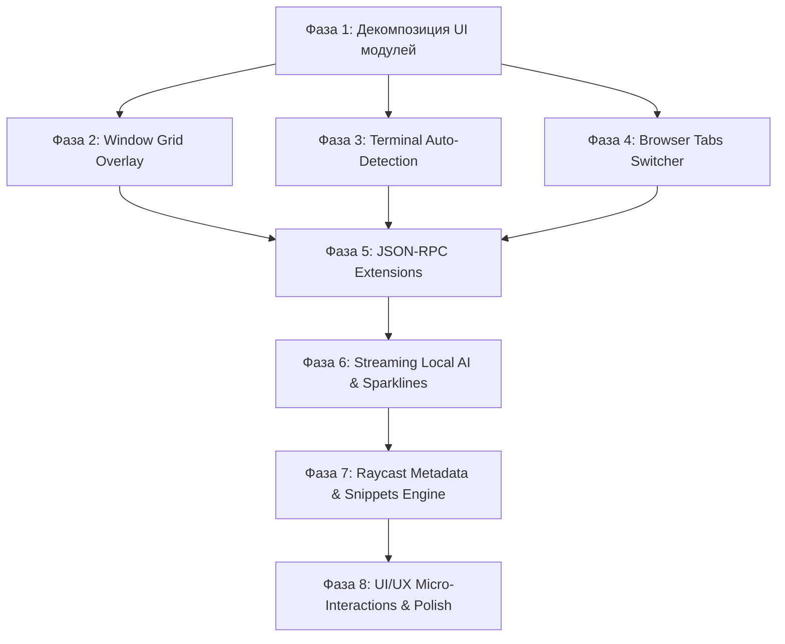

# 🚀 Zeshicast — Master Implementation Plan

> **Zeshicast** — Native Linux Command Center & Raycast v2 Alternative for Wayland / GTK4.
> Стек: **Rust** + **GTK4** + **gtk4-layer-shell** | **NixOS** / **Niri** / **Hyprland** / **Sway**.

---

## 📌 Содержание
1. [Архитектурное видение и дизайн-система](#1-архитектурное-видение-и-дизайн-система)
2. [Текущий статус кодовой базы (Baseline)](#2-текущий-статус-кодовой-базы-baseline)
3. [Матрица возможностей (Feature Matrix)](#3-матрица-возможностей-feature-matrix)
4. [Пошаговый план реализации (Phased Master Plan)](#4-пошаговый-план-реализации-phased-master-plan)
   - [Фаза 1: Декомпозиция и модульность UI](#фаза-1-декомпозиция-и-модульность-ui)
   - [Фаза 2: Window Management Grid Overlay (Raycast 2.0 Parity)](#фаза-2-window-management-grid-overlay-raycast-20-parity)
   - [Фаза 3: Автоопределение терминалов и интерактивный шелл](#фаза-3-автоопределение-терминалов-и-интерактивный-шелл)
   - [Фаза 4: Browser Tabs Switcher (IPC & Session Provider)](#фаза-4-browser-tabs-switcher-ipc--session-provider)
   - [Фаза 5: JSON-RPC 2.0 Process Isolation Extensions Protocol](#фаза-5-json-rpc-20-process-isolation-extensions-protocol)
   - [Фаза 6: Streaming Local AI (SSE) и живые Sparkline-графики](#фаза-6-streaming-local-ai-sse-и-живые-sparkline-графики)
   - [Фаза 7: Парсер метаданных Raycast Script (`@raycast.*`) и Сниппеты](#фаза-7-парсер-метаданных-raycast-script-raycast-и-сниппеты)
   - [Фаза 8: UI/UX Micro-Interactions & Design Polish](#фаза-8-uiux-micro-interactions--design-polish)
5. [Безопасность, приватность и политика отказоустойчивости](#5-безопасность-приватность-и-политика-отказоустойчивости)
6. [Протокол верификации и тестирования](#6-протокол-верификации-и-тестирования)

---

## 1. Архитектурное видение и дизайн-система

### Принцип «Quiet Linux Cockpit»
- **Скорость:** Мгновенный запуск окна (<50мс), неблокирующий GTK Event Loop, все системные вызовы в фоне через `tokio` / потоки / `gio::Cancellable`.
- **Плотность и сканируемость:** Компактная верстка, 60px поисковая строка, однострочные заголовки элементов, моноширинные бейджи для хоткеев (`[H]`, `[K]`, `[Enter]`).
- **Соблюдение дизайн-системы Raycast v2:**
  - Системные переменные темы: `@window_bg_color`, `@window_fg_color`, `@accent_color`.
  - Встроенные шрифты: `Outfit` (заголовки и UI) и `JetBrainsMono` (код, хоткеи, пути).
  - Анимированные виджеты: всплывающие OSD-пилюли раскладки клавиатуры (`src/ui/osd.rs`), сегментированные полосы памяти RAM, кастомные ползунки `GtkScale` и скроллбары.

---

## 2. Текущий статус кодовой базы (Baseline)

- **Ветка:** `main` (`aa42956`)
- **Тесты:** 102 теста пройдено (`102 passed, 0 failed`).
- **Nix Flake:** `nix flake check` и экспорт `homeManagerModules.default` полностью валидны.
- **Хранилище:** SQLite (`services/storage.rs`) с правами `0600` и схемой миграций.
- **D-Bus Daemon:** Встроенный сервер `org.freedesktop.Notifications` (`src/ui/notify_server.rs`).

---

## 3. Матрица возможностей (Feature Matrix)

| Возможность | Статус в `main` | Целевое состояние |
| :--- | :---: | :--- |
| **XDG Apps & Files Search** | ✅ Готово | Индексация desktop-файлов и поиск по файловой системе |
| **D-Bus Notification Server** | ✅ Готово | Перехват `org.freedesktop.Notifications` в SQLite |
| **Clipboard History (Text + Images)** | ✅ Готово | Хранение в SQLite, генерация миниатюр изображений |
| **Keyboard Layout OSD Pill** | ✅ Готово | Всплывающее layer-shell окно при переключении раскладки |
| **Embedded Font Auto-Loading** | ✅ Готово | Шрифты `Outfit` и `JetBrainsMono` встроены в бинарник |
| **Audio & WirePlumber Control** | ✅ Готово | Управление устройствами, микрофоном и потоками через `wpctl` |
| **Network Manager & Wi-Fi** | ✅ Готово | Сканирование и переключение точек доступа через `nmcli` |
| **Media Player Control (MPRIS)** | ✅ Готово | Обложки треков, таймлайн, кнопки управления |
| **Markdown Renderer** | ✅ Готово | Парсинг и рендеринг списков, кода и цитат |
| **Window Management Grid Overlay** | ⏳ Интеграция | Визуальный Cairo-оверлей с динамической сеткой (Half/Third/Full) |
| **Terminal Auto-Detection** | ⏳ Интеграция | Автопоиск `ghostty`, `foot`, `kitty` и вторичное действие `Run in Terminal` |
| **Browser Tabs Switcher** | ⏳ Интеграция | Поиск открытых вкладок в Chrome, Brave, Firefox |
| **JSON-RPC Extensions Protocol** | ⏳ Интеграция | Стандартизированный протокол изолированных плагинов |
| **Streaming Local AI (SSE)** | ⏳ Интеграция | Потоковый вывод токенов + кнопка отмены генерации |
| **Raycast Script Metadata Parser** | ⏳ Интеграция | Полная поддержка `@raycast.*` аргументов и генерации форм |
| **UI/UX Micro-Interactions & Polish** | ⏳ Интеграция | Физические кейкапы, интерактивный Dashboard, Selected row bar |

---

## 4. Пошаговый план реализации (Phased Master Plan)



---

### Фаза 1: Декомпозиция и модульность UI
**Цель:** Разделить 3700-строчный [`src/ui/views.rs`](file:///home/blackzeshi/Git/zeshicast/src/ui/views.rs) и 3200-строчный [`src/ui/launcher.rs`](file:///home/blackzeshi/Git/zeshicast/src/ui/launcher.rs) на чистые, изолированные подмодули без изменения внешнего вида и стилей.

1. **Создание структуры `src/ui/views/`:**
   - `dashboard.rs`, `system_monitor.rs`, `audio.rs`, `network.rs`, `media.rs`
   - `notifications.rs`, `clipboard_history.rs`, `snippets.rs`, `preferences.rs`
   - `ai_chat.rs`, `fonts.rs`, `emoji.rs`, `script_output.rs`, `extension_browser.rs`
   - `action_panel.rs`, `mod.rs`
2. **Создание структуры `src/ui/launcher/`:**
   - `search_entry.rs` (поисковая строка и фильтры)
   - `root_list.rs` (список результатов и делегаты строк)
   - `footer.rs` (подвал и индикаторы хоткеев)
   - `actions.rs` (обработка действий и клавиатурных событий)
   - `mod.rs`
3. **Критерий приемки:**
   - Все 102 теста проходят, `cargo check --features gui` компилируется без предупреждений.
   - Размер каждого отдельного файла UI не превышает 500–600 строк.

---

### Фаза 2: Window Management Grid Overlay (Raycast 2.0 Parity)
**Цель:** Добавить экран интерактивного визуализатора сетки окон для Wayland-композиторов (Niri, Hyprland, Sway).

1. **Создание [`src/ui/views/window_grid.rs`](file:///home/blackzeshi/Git/zeshicast/src/ui/views/window_grid.rs):**
   - Виртуальный экран через `gtk::DrawingArea` с отрисовкой пропорций монитора в Cairo.
   - Подсветка активной зоны привязки: `LeftHalf`, `RightHalf`, `TopHalf`, `BottomHalf`, `Fullscreen`, `Center`, `TopLeft`, `TopRight`, `BottomLeft`, `BottomRight`.
2. **Интеграция горячих клавиш и команд композиторов:**
   - Клавиатурные подсказки: `[H]` (Left), `[L]` (Right), `[K]` (Top), `[J]` (Bottom), `[F]` (Fullscreen), `[C]` (Center).
   - Диспетчер команд в [`src/services/compositor.rs`](file:///home/blackzeshi/Git/zeshicast/src/services/compositor.rs) (`niri msg action`, `hyprctl dispatch`, `swaymsg`).
3. **Критерий приемки:**
   - Открытие экрана по запросу `window grid` или `grid`.
   - Мгновенное выполнение действий привязки окон.

---

### Фаза 3: Автоопределение терминалов и интерактивный шелл
**Цель:** Автоматическое обнаружение установленного эмулятора терминала и запуск интерактивных скриптов.

1. **Создание [`src/services/terminal.rs`](file:///home/blackzeshi/Git/zeshicast/src/services/terminal.rs):**
   - Сканирование `$PATH` на наличие: `ghostty`, `foot`, `kitty`, `alacritty`, `wezterm`, `gnome-terminal`, `konsole`, `xterm`.
   - Приоритет: `preferences.toml` (`default_terminal`) > `$TERMINAL` > автопоиск в `$PATH`.
2. **Вторичное действие `Run in Terminal` (`Ctrl+Enter` / `Ctrl+K`):**
   - Добавление `SecondaryActionKind::RunInTerminal` в [`src/action.rs`](file:///home/blackzeshi/Git/zeshicast/src/action.rs).
   - Оборачивание команды в `bash -c "...; read -p 'Press Enter to exit'"` для сохранения вывода на экране.
3. **Критерий приемки:**
   - Юнит-тесты на выбор терминала и оверрайд из настроек.

---

### Фаза 4: Browser Tabs Switcher (IPC & Session Provider)
**Цель:** Мгновенный поиск и переход к открытым вкладкам браузера прямо из главного поиска.

1. **Создание [`src/search/browser_tabs.rs`](file:///home/blackzeshi/Git/zeshicast/src/search/browser_tabs.rs):**
   - Чтение сессий и IPC Chrome / Chromium / Brave / Firefox.
   - Поддержка быстрого перехода (фокусировка окна браузера и выбор нужной вкладки).
2. **Интеграция в корневой поисковый пайплайн:**
   - Префикс `tab:` или автоматический скоринг по названию страницы и URL.
3. **Критерий приемки:**
   - Поиск вкладок с отображением иконки браузера и URL в качестве подзаголовка.

---

### Фаза 5: JSON-RPC 2.0 Process Isolation Extensions Protocol
**Цель:** Поддержка изолированных пользовательских расширений на любом языке программирования через стандартный JSON-RPC 2.0.

1. **Создание [`src/search/extensions.rs`](file:///home/blackzeshi/Git/zeshicast/src/search/extensions.rs):**
   - Спецификация манифеста `extension.toml` (`name`, `version`, `author`, `commands`, `schema`).
   - Изолированный процесс со связью через `stdin` / `stdout`.
2. **Методы протокола:**
   - `list_commands` — получение списка команд расширения.
   - `search` — передача пользовательского запроса расширению.
   - `execute` — запуск действия с контекстом.
3. **Критерий приемки:**
   - Защита от зависания плагина через таймауты (`tokio::time::timeout`).

---

### Фаза 6: Streaming Local AI (SSE) и живые Sparkline-графики
**Цель:** Стриминг генерации ответов нейросетей посимвольно (Server-Sent Events) и интерактивные графики загрузки системы.

1. **SSE-стриминг в [`src/services/local_ai.rs`](file:///home/blackzeshi/Git/zeshicast/src/services/local_ai.rs):**
   - Чтение `chunked` SSE-потока от Ollama / OpenAI-compatible API.
   - Передача каждого токена в GTK UI через канал `glib::MainContext::channel`.
   - Интерактивная кнопка Stop/Cancel с `AtomicBool`.
2. **Спарклайны в [`src/ui/views/system_monitor.rs`](file:///home/blackzeshi/Git/zeshicast/src/ui/views/system_monitor.rs):**
   - 60-точечный буфер истории CPU/RAM.
   - Отрисовка сглаженного графика в Cairo с градиентной заливкой под кривой.
3. **Критерий приемки:**
   - Отсутствие фризов UI при генерации длинных ответов.

---

### Фаза 7: Парсер метаданных Raycast Script (`@raycast.*`) и Сниппеты
**Цель:** 100% совместимость со скриптами экосистемы Raycast и продвинутая подстановка сниппетов.

1. **Парсер `@raycast.*` в [`src/search/scripts.rs`](file:///home/blackzeshi/Git/zeshicast/src/search/scripts.rs):**
   - Поддержка `@raycast.schemaVersion`, `@raycast.title`, `@raycast.mode`, `@raycast.packageName`, `@raycast.icon`.
   - Парсинг динамических аргументов `@raycast.argument1 { "type": "text", "placeholder": "query" }` с автогенерацией полей ввода.
2. **Продвинутые плейсхолдеры сниппетов:**
   - `{uuid}`, `{user}`, `{hostname}`, `{date:FORMAT}`, `{time}`, `{calc:...}`, `{clipboard}`.
   - Эмуляция ввода текста через `wtype` / `ydotool` или копирование в буфер обмена.
3. **Критерий приемки:**
   - Корректная подстановка всех токенов и запуск скриптов с динамическими аргументами.

---

### Фаза 8: UI/UX Micro-Interactions & Design Polish
**Цель:** Доведение тактильности, микровзаимодействий и визуальной иерархии до совершенства на основе дизайн-аудита.

1. **⌨️ Физические бейджи клавиш (Keycap Badges & Categories):**
   - Стилизация хоткеев (`[Enter]`, `[Ctrl+K]`, `[H]`, `[L]`) и категорийных плашек (`SYSTEM`, `APP`, `FILE`): шрифт `JetBrains Mono`, `11px`, `letter-spacing: 0.5px`, `text-transform: uppercase`, тонкая рамка `1px solid alpha(@window_fg_color, 0.12)` и подложка `alpha(@window_fg_color, 0.08)`.
2. **⚡ Интерактивный переход из Dashboard (`Ctrl+D`):**
   - Клик или нажатие `Enter` на карточке CPU/RAM -> мгновенный переход в **System Monitor** (`View::SystemMonitor`).
   - На карточке Audio -> переход в **Audio Control** (`View::Audio`).
   - На карточке Network -> переход в **Network Manager** (`View::Network`).
   - На карточке Media -> переход в **Media Player** (`View::Media`).
3. **🎯 Индикатор фокуса выбранной строки (Selected Row Cue):**
   - Добавление тонкого вертикального акцентного штриха слева (`box-shadow: inset 3px 0 0 @accent_color;`) на активном элементе списка.
4. **💡 Умный пустой экран поиска (Smart Empty State):**
   - При отсутствии совпадений по запросу предлагать контекстные fallback-действия: `[↵ Спросить у Local AI]`, `[↵ Найти в Web]`, `[↵ Создать Quicklink]`.
5. **🤖 Статус генерации в AI Chat и вывод скриптов:**
   - В заголовке чата бейдж `Ollama · qwen2.5 · Streaming...` с мигающим курсором `▋`.
   - В `ScriptOutputView` таймер исполнения (`⏱ 0.35s · Exit 0`).
6. **⚠️ Визуальное выделение опасных действий:**
   - Мягкая предупреждающая подсветка (`#ff6b5f`) иконки и хоткея для деструктивных действий (Power Off, Reboot, Kill -9, Clear Clipboard).
7. **Критерий приемки:**
   - Полное сохранение дизайн-токенов Raycast v2, нулевые фризы анимаций, мгновенная тактильная обратная связь.

---

## 5. Безопасность, приватность и политика отказоустойчивости

1. **Модель угроз (Threat Model):**
   - Запрет выполнения произвольного шелла расширениями без явного разрешения `capabilities = ["shell"]`.
   - Изоляция баз данных SQLite с маской `0600`.
   - Защита от TOCTOU: запись файлов через временные файлы с атомарной заменой `tempfile::NamedTempFile`.
2. **Приватный режим:**
   - При включении режима приватности буфер обмена не сохраняет пароли и секретные ключи.
   - Функция санитизации конфигов перед экспортом (`sanitized_export`).
3. **Zero-Crash Policy:**
   - Никаких `unwrap()` на данных из D-Bus, сети или пользовательских файлов.
   - Ограничение глубины рекурсии при запросах к древу окон Sway/Hyprland.

---

## 6. Протокол верификации и тестирования

Каждая фаза считается завершенной только после прохождения полного цикла валидации:

1. **Модульные и интеграционные тесты:**
   ```bash
   cargo test --lib
   ```
2. **Сборка со всеми фичами GTK4 / Wayland:**
   ```bash
   nix develop -f shell.nix --command cargo check --features gui,layer-shell
   ```
3. **Валидация Nix Flake:**
   ```bash
   nix flake check
   ```
4. **Валидация конфигурации Home Manager:**
   ```bash
   nh home switch .
   ```
5. **Zero Warnings Policy:** 0 предупреждений компилятора (`clippy` и `rustc`).

---
*Документ утвержден и зафиксирован как единый план разработки Zeshicast.*
