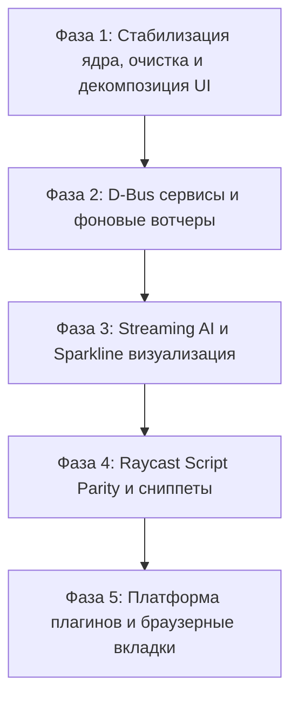

# Zeshicast: Master Plan & Engineering Roadmap

## 1. Executive Summary & Vision

**Zeshicast** — это нативный клавиатурно-ориентированный командный центр и лаунчер для Linux (Wayland / Niri / Hyprland / Sway / NixOS), созданный на стеке **Rust + GTK4 + gtk4-layer-shell**.

Проект объединяет в едином интерфейсе:
1. **Быстрый лаунчер (Root Search):** мгновенный поиск приложений (XDG Desktop + `nix-store`), файлов, сниппетов, закладок, математический калькулятор и история буфера обмена.
2. **Командный центр Linux (Command & Control Center):** единый дашборд и виджеты мониторинга системы, управления сетью (Wi-Fi, VPN), медиаплеерами (MPRIS), аудиоустройствами (WirePlumber), уведомлениями (Dunst/Swaync) и процессами.
3. **Локальный AI-ассистент:** легковесный интерфейс взаимодействия с локальными моделями через Ollama или OpenAI-совместимые API без необходимости открывать браузер или тяжелые веб-интерфейсы.
4. **Экосистема расширений:** запуск скриптов с метаданными Raycast/Vicinae, пользовательских TOML-команд с интерактивными формами аргументов и изолированных плагинов.

---

## 2. Ключевые принципы и дизайн-система ("Quiet Linux Cockpit")

### 2.1. Принципы разработки
- **Keyboard-First:** любая операция, переход между экранами и управление действиями доступны без мыши.
- **Sub-millisecond Search & Zero UI Freezes:** поиск выполняется мгновенно; все тяжелые I/O (диск, сеть, LLM) работают асинхронно или в фоновых потоках без блокировки главного цикла GTK.
- **Native Wayland & Compositor-Aware:** использование `gtk4-layer-shell` для мгновенного появления поверх окон; интеграция с IPC композиторов (Niri, Hyprland, Sway).
- **Graceful Degradation:** отсутствие любого внешнего демона (NetworkManager, Dunst, Ollama) отображает аккуратный empty-state и не ломает работу остального лаунчера.

### 2.2. Дизайн-токены и типографика
- **Окно:** 860×600px по умолчанию, `border-radius: 12px`, тонкая рамка 1px с мягкой тенью.
- **Цветовая палитра (Dark Cockpit):**
  - `window`: `#111216` (основной фон)
  - `surface`: `#17191f` (карточки и приподнятые панели)
  - `surface_muted`: `#14161b` (подвал и статусная строка)
  - `border`: `#2a2d36` (разделители)
  - `text`: `#eceff4` (основной текст)
  - `text_muted`: `#9aa3b2` (метаданные и подсказки)
  - `accent`: `#8ab4f8` (фокус, активные элементы)
  - `danger`: `#ff6b5f` (деструктивные действия: kill process, clear history)
  - `success`: `#6dd58c` (статус "ОК", подключен)
  - `warning`: `#f4c76b` (предупреждения, высокая нагрузка)
- **Типографика:** `Outfit, Inter, Noto Sans, sans-serif`. Заголовок строки — 15px (500 weight), вторичный текст — 12px, заголовки секций — 12px (600 weight).

### 2.3. Архитектура экранов (In-Window Navigation Stack)
- **Root Search (`/`):** поисковая строка (60px), список результатов с секциями (Favourites, Recent, Command Center), Footer Actions (40px) и Status Strip (34px).
- **Action Panel (`Ctrl+K`):** выезжающая контекстная панель действий (Primary, Manage, Clipboard, Danger).
- **Dashboard (`Ctrl+D`):** обзор состояния системы в реальном времени (CPU, RAM, Disk, Батарея, Сеть, Звук, Медиа, Уведомления, DND).
- **System Monitor (`Ctrl+T`):** подробный монитор ресурсов (нагрузка по ядрам, память, температуры `/sys/class/thermal`, список процессов по RSS с возможностью `kill`).
- **Network View (`Ctrl+N`):** интерфейсы, IP/MAC, сканирование Wi-Fi, статус VPN/WireGuard.
- **Media View (`Ctrl+M`):** MPRIS-плееры, текущий трек, кнопки управления воспроизведением.
- **Notifications View (`Ctrl+U`):** история уведомлений, кнопка DND, очистка.
- **AI Chat (`Ctrl+I`):** компактный диалог с локальной языковой моделью (Ollama), возможность скопировать ответ или сохранить в сниппеты.
- **Preferences (`Ctrl+,`):** настройки горячих клавиш, видимости секций, интервалов поллинга и эндпоинтов AI.

---

## 3. Текущее состояние и аудит кодовой базы

- **Базовые тесты:** 67 passed, 0 failed (`cargo test`).
- **Модули в `src/`:**
  - `src/search/` (15 файлов): `apps.rs`, `files.rs`, `calculator.rs`, `clipboard.rs`, `commands.rs`, `scripts.rs`, `system.rs`, `windows.rs`, `emoji.rs`, `named_values.rs`, `web.rs`, `processes.rs`, `media.rs`, `notifications.rs`, `mod.rs`.
  - `src/services/` (10 файлов): `storage.rs` (SQLite), `audio.rs`, `network.rs`, `media.rs`, `notifications.rs`, `system_stats.rs`, `thermal.rs`, `battery.rs`, `local_ai.rs`, `mod.rs`.
  - `src/ui/` (13 файлов): `launcher.rs`, `views.rs`, `style.rs`, `widgets.rs`, `status_strip.rs`, `panels.rs`, `forms.rs`, `icons.rs`, `navigation.rs`, `preferences.rs`, `launcher_views.rs`, `launcher_helpers.rs`, `mod.rs`.
  - `src/app.rs`, `src/action.rs`, `src/config.rs`, `src/placeholders.rs`, `src/lib.rs`, `src/main.rs`.

---

## 4. Пошаговый мастер-план внедрения и исправлений

### Фаза 1: Стабилизация ядра, устранение техдолга и декомпозиция UI
> **Цель:** избавиться от громоздких файлов-монолитов, очистить мертвый код и зафиксировать модульную структуру компонентов.

- [x] **1.1. Очистка неиспользуемого кода и предупреждений компилятора**
  - Очистить/задействовать функции в `src/config.rs`: `write_frequencies`, `load_clipboard_timestamps`, `write_clipboard_timestamps`, `format_time_ago`.
  - Очистить/задействовать функции в `src/search/scripts.rs`: `run_script_stdout`, `parse_script_json_output`.
  - Проверить чистоту сборки `cargo check --lib` и `cargo test` без ворнингов.
- [x] **1.2. Декомпозиция `src/ui/views.rs` (~72 KB) на независимые экраны**
  - Создать директорию `src/ui/views/` и вынести представления:
    - `src/ui/views/dashboard.rs` — разметка дашборда и карточек.
    - `src/ui/views/system_monitor.rs` — системный монитор и список процессов.
    - `src/ui/views/network.rs` — экран интерфейсов, Wi-Fi и VPN.
    - `src/ui/views/media.rs` — MPRIS плеер.
    - `src/ui/views/notifications.rs` — история уведомлений.
    - `src/ui/views/ai_chat.rs` — диалог AI Chat.
    - `src/ui/views/clipboard_history.rs` — расширенный просмотр истории буфера.
    - `src/ui/views/mod.rs` — реэкспорт и общий роутинг стэка.
- [x] **1.3. Декомпозиция `src/ui/launcher.rs` (~72 KB)**
  - Разделить логику:
    - `src/ui/launcher/root_list.rs` — рендеринг строк результатов, секций и иконок.
    - `src/ui/launcher/search_entry.rs` — поле ввода, префиксы, автодополнение.
    - `src/ui/launcher/footer.rs` — нижняя панель подсказок и статуса.
    - `src/ui/launcher/clipboard.rs` — фоновый монитор и буфер.
    - `src/ui/launcher/actions.rs` — диспетчер команд и действий.
    - `src/ui/launcher/mod.rs` — сборка UI и точка входа окна.
- [x] **1.4. Верификация**
  - Сборка и прогон тестов `cargo test` (68 passed, 0 failed, 0 warnings).

---

### Фаза 2: Глубокие системные интеграции (D-Bus & Async Services)
> **Цель:** заменить вызовы внешних CLI-утилит на прямые асинхронные D-Bus интерфейсы для максимальной скорости и надежности.

- [x] **2.1. Фоновый File Watcher (inotify / notify-rs)**
  - Заменить периодическое пересканирование директорий на фоновый вотчер `notify` для файлов `$HOME` (с лимитами на `target/`, `.git/`, `node_modules/`).
  - Мгновенная инвалидация и обновление индекса файлов при добавлении/удалении.
- [x] **2.2. Нативный D-Bus клиент для MPRIS (`org.mpris.MediaPlayer2`)**
  - Заменить парсинг `playerctl` на прямые вызовы D-Bus через `zbus`.
  - Прямые вызовы playback-методов (PlayPause, Next, Previous, Stop) через `mpris_dbus_command`.
- [x] **2.3. Нативный D-Bus клиент для NetworkManager**
  - Подключение к `org.freedesktop.NetworkManager` через `zbus` для получения активных VPN соединений и интерфейсов.
  - Безопасный fallback на `/sys/class/net` и `nmcli`, если NetworkManager не запущен.
- [x] **2.4. Прямой D-Bus интерфейс уведомлений**
  - Прямая интеграция с сервером уведомлений (Dunst / `org.freedesktop.Notifications`) через D-Bus для получения истории, счетчика и переключения DND.
- [x] **2.5. Улучшенная интеграция со звуком (WirePlumber / PipeWire)**
  - Получение узлов и стримов напрямую, управление громкостью приложений и микрофона (`set_audio_volume`, `toggle_audio_mute`, `set_stream_volume`).

---

### Фаза 3: Потоковый Local AI и Sparkline-визуализация
> **Цель:** сделать AI Chat по-настоящему интерактивным (streaming) и добавить наглядные графики загрузки системы.

- [x] **3.1. Server-Sent Events (SSE) Streaming в `AiChatView`**
  - Поддержка потокового чтения чанков от Ollama (`/api/generate` или `/api/chat` с `stream: true`).
  - Потоковый рендеринг генерируемого текста в реальном времени через `glib::timeout_add_local` и mpsc канал.
- [x] **3.2. Управление генерацией (Abort / Cancel)**
  - Добавлен флаг отмены `AtomicBool` и кнопка "Stop" в UI с переходом в статус `Cancelled`.
- [x] **3.3. Сессионная память и контекст диалога**
  - Модель `ChatMessage` и функция `ask_local_ai_chat_streaming` для мульти-сообщенческого контекста.
  - Быстрое действие: "Сохранить ответ как сниппет" с тегом `ai`.
  - Возможность передать текущий текст из буфера обмена как контекст запроса нажатием кнопки "Use Clipboard".
- [x] **3.4. Sparkline-графики в реальном времени (Cairo DrawingArea)**
  - Реализован кольцевой буфер (rolling history на 60 точек) для CPU %, RAM %, Disk %.
  - Отрисовка минималистичных графиков на Cairo с градиентной заливкой в карточках `DashboardView` и `SystemMonitorView`.

---

### Фаза 4: Расширенная совместимость с Raycast & Сниппеты
> **Цель:** максимальная поддержка каталогов скриптов Raycast и продвинутая автоматизация ввода.

- [x] **4.1. Полная поддержка Raycast Script Commands Metadata**
  - Поддержка тегов:
    - `@raycast.mode` (`fullOutput`, `compact`, `silent`, `inline`).
    - `@raycast.argument1`, `@raycast.argument2` с параметрами `placeholder`, `optional`.
    - `@raycast.packageName`, `@raycast.icon`, `@raycast.currentDirectoryPath`.
    - `@raycast.needsConfirmation` для скриптов.
  - Автоматическая генерация интерактивных форм ввода `ActionForm` перед запуском скрипта.
- [x] **4.2. Продвинутая система сниппетов**
  - Snippet Manager: создание, сохранение с тегом `ai`, поддержка одиночных и двойных скобок `{date}`, `{time}`, `{datetime}`, `{user}`, `{hostname}`, `{uuid}`, `{clipboard}`, `{query}`.
  - Двойной режим вставки: `type_text` (через `wtype` / `ydotool`) и копирование в буфер `copy_text` / `wl-copy`.
- [x] **4.3. Быстрые ссылки (Quicklinks)**
  - Поддержка URL-шаблонов (`https://github.com/search?q={query}`) с плейсхолдерами из строки поиска.
  - Импорт/экспорт конфигураций через `export_config` и `import_config`.

---

### Фаза 5: Платформа плагинов и браузерные интеграции
> **Цель:** предоставить открытый API для расширения функционала сторонними разработчиками.

- [x] **5.1. JSON-RPC Process Isolation Extension Protocol**
  - Архитектура плагинов, запускаемых как дочерние процессы (на любом языке: Rust, Python, Bash, Node.js).
  - Обмен данными через stdin/stdout по протоколу JSON-RPC 2.0 (`ExtensionManifest`, `query_extension_jsonrpc`, `search_extensions`, возврат `ExtensionItem`).
- [x] **5.2. Browser Tab Switcher (Firefox / Chrome Native Messaging)**
  - Поиск по открытым вкладкам браузера (`search_browser_tabs`, сопоставление заголовков и URL) и мгновенный переход к нужному окну через IPC композитора.
- [x] **5.3. Композиторные расширения (Niri, Hyprland, Sway)**
  - Переключение воркспейсов, перемещение окон, фокусировка окон по заголовку и классу приложения (`search_niri_actions`, `search_hyprland_actions`, `search_sway_actions`, `search_windows`).

---

### Фаза 6: Raycast 2.0 Parity — Window Management Visual Grid Overlay
> **Цель:** предоставить интерактивный визуальный экран тайлинга и размещения окон в стиле Raycast 2.0 Grid.

- [x] **6.1. Интерактивный Cairo экран-визуализатор (`src/ui/views/window_grid.rs`)**
  - Визуализация виртуального монитора с сеткой экрана, динамической подсветкой активной зоны тайлинга (`LeftHalf`, `RightHalf`, `TopHalf`, `BottomHalf`, `Fullscreen`, `Center`, угловые четверти).
- [x] **6.2. Пресеты размещения и тайлинга окон**
  - Быстрые кнопки и хоткеи (`Left`, `Right`, `Up`, `Down`, `Fullscreen`, `Center 70%`, `Top Left/Right`, `Bottom Left/Right`).
  - Тонкая регулировка ширины столбца (`+10%`, `-10%`) и закрытие окна.
- [x] **6.3. Нативная диспетчеризация под Niri, Hyprland, Sway**
  - Поддержка Niri IPC (`consume-or-expel-window-left/right`, `center-column`, `set-column-width`, `set-window-height`).
  - Поддержка Hyprland IPC (`hyprctl dispatch movewindow`, `fullscreen`, `togglefloating`, `splitratio`).
  - Поддержка Sway IPC (`swaymsg move`, `fullscreen`, `floating`, `resize`).
- [x] **6.4. Интеграция в Navigation Stack и Root Search**
  - Команда `Window Grid & Snap`, хоткеи управления в оверлее (`H/J/K/L`, стрелки, `Enter`, `M`, `C`, `+`, `-`).

---

### Фаза 7: Default Terminal Auto-Detection & Interactive Shell Execution
> **Цель:** автодетекция установленных терминалов в системе, настройка терминала по умолчанию и запуск CLI-команд/скриптов в нативном терминале.

- [x] **7.1. Модуль автодетекции терминалов (`src/services/terminal.rs`)**
  - Определение установленных терминалов в `$PATH`: `Ghostty`, `Foot`, `Kitty`, `Alacritty`, `WezTerm`, `Rio`, `GNOME Terminal`, `Konsole`, `XFCE Terminal`, `rxvt-unicode`, `XTerm`.
  - Учет флагов запуска команд (`-e`, `--`, `start --`).
  - Разрешение терминала: приоритет пользовательских настроек `default_terminal` > `$TERMINAL` > первый доступный в системе > fallback `xterm`.
- [x] **7.2. Вторичное действие `Run in Terminal` (`SecondaryActionKind::RunInTerminal`)**
  - Возможность запуска любой shell-команды, скрипта или расширения в интерактивном окне сконфигурированного терминала с удержанием экрана после выполнения.
- [x] **7.3. Поиск и интеграция с Preferences**
  - Настройка `default_terminal` в панели Preferences (`src/ui/preferences.rs`).
  - Поиск доступных и дефолтного терминала в корневом поиске (`Terminal: Launch <Name>`).

---

## 5. Definition of Done (DoD) и метрики качества

1. **Производительность:**
   - Время отклика лаунчера при вызове по хоткею: `< 15ms`.
   - Задержка фильтрации 10 000 элементов при вводе: `< 5ms`.
   - Потребление памяти в фоновом режиме: `< 45 MB RSS`.
2. **Стабильность:**
   - 100% прохождение тестов `cargo test`.
   - Чистая сборка `cargo check --features gui` без ворнингов компилятора.
3. **Совместимость:**
   - Полная работоспособность под Wayland (Niri, Hyprland, Sway) в дистрибутивах NixOS, Arch Linux, Fedora, Ubuntu.

---

## 6. Индекс архива документации

Все исходные проектные брифы, матрицы фич и черновые планы сохранены для исторической справки в директории `docs/archive/`:
- `docs/archive/claude-code-briefing.md` — изначальный бриф по Raycast-клону для Niri/Wayland.
- `docs/archive/DESIGN.md` — исходное дизайн-видение компонентов интерфейса.
- `docs/archive/design-system-plan.md` — развернутое описание дизайн-системы, токенов и макетов экранов.
- `docs/archive/linux-command-center-plan.md` — продуктовый план трансформации лаунчера в Command Center.
- `docs/archive/raycast-linux-features.md` — сравнительная матрица функционала Raycast v2 под Linux.
- `docs/archive/vicinae-parity-roadmap.md` — план модульного разделения архитектуры по образцу Vicinae.
